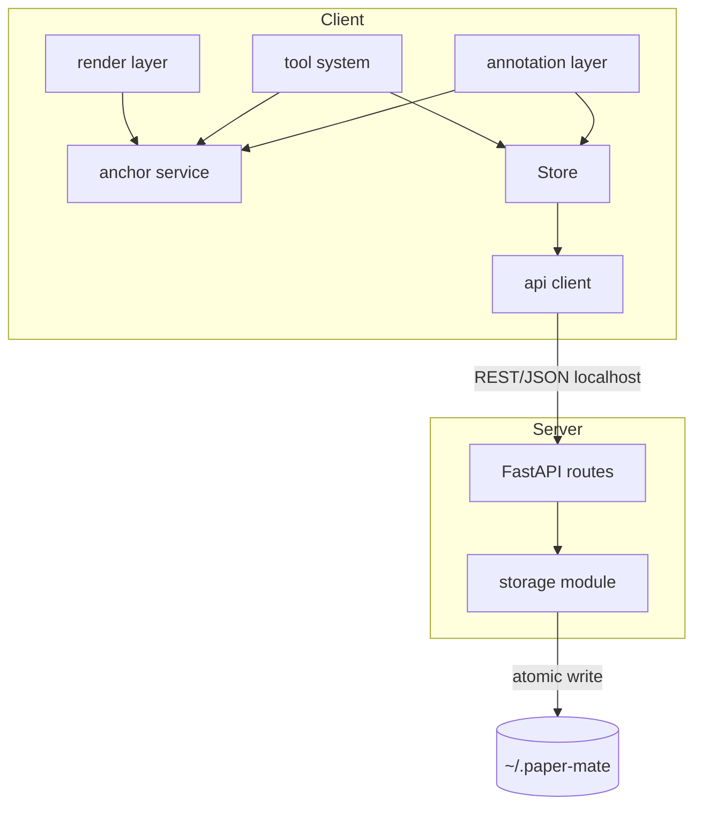
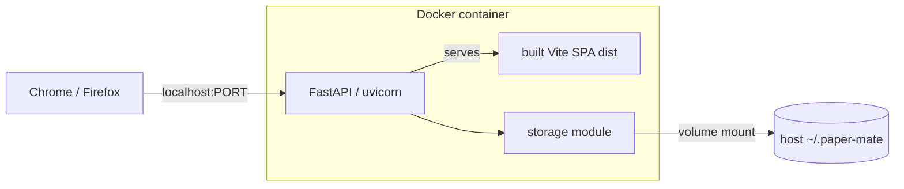

# Architecture Spine — Paper Mate

## Design Paradigm

**Client-authoritative layered SPA over a dumb filesystem store.** All annotation behaviour and editing intelligence live in the browser; the backend is a thin durable persistence + file-serving layer with no domain logic.

Two processes, one container:

- **Client (React/Vite SPA)** — layered: `render → anchor → annotation/tool → store → api-client`. Strict downward dependency.
- **Server (FastAPI)** — two layers: `routes → storage`. Storage is the only disk writer.

Layer-to-directory mapping lives in *Structural Seed*.

## Invariants & Rules

Dependency direction (a rule, not a picture):



### AD-1 — Runtime topology `[ADOPTED]`
- **Binds:** all; NFR-4
- **Prevents:** per-browser storage divergence; the Firefox local-disk gap (Firefox has no File System Access for local disk, verified 2026-06)
- **Rule:** the app is a localhost SPA (Chrome/Firefox) talking to a dockerized FastAPI backend that owns all disk I/O via a host volume mount. The client never touches the filesystem; all persistence goes through the backend API.

### AD-2 — Stack `[ADOPTED]`
- **Binds:** all
- **Prevents:** redundant second server; SSR machinery with no payoff
- **Rule:** backend = Python/FastAPI + Pydantic v2; frontend = React + Vite SPA + TypeScript (no meta-framework); PDF rendering = `pdfjs-dist` raw with a custom overlay (its built-in annotation layer is for embedded form/link annots only, not our marks).

### AD-3 — Contract sync
- **Binds:** annotation model, all API types
- **Prevents:** drift between server schema and client model
- **Rule:** Pydantic models are the single source of the annotation model + API contract → FastAPI OpenAPI → **generated** TS types for the client via `openapi-typescript`. Client API types are generated, never hand-authored.

### AD-4 — Spatial-anchor model (core invariant)
- **Binds:** FR-1..FR-22; NFR-3; all phases (annotations, Phase 2 ref-previews, Phase 3 click-to-chat targeting)
- **Prevents:** zoom/DPI/resize drift; incompatible per-feature coordinate schemes; ambiguous geometry encodings
- **Rule:** all annotation geometry is stored in **page-normalized coordinates** — fractions `[0,1]` of page width/height — never screen pixels or raw PDF points. Screen position is always derived, never persisted. Pinned conventions (no encoding left to the implementer):
  - **Origin top-left, y-down.** The render layer converts PDF's bottom-left space to top-left *once*; the anchor service works only in top-left space.
  - **Normalization basis = the rendered page box** = the PDF.js page viewport at scale 1.0 using the **CropBox with `/Rotate` applied**, measured in **CSS pixels** (device-pixel-ratio divided out). The render layer is the single source of this page box; the anchor service normalizes/denormalizes against it only.
  - **Rect form is canonical** `{x0, y0, x1, y1}` with `x0 ≤ x1`, `y0 ≤ y1` — canonicalized on create (negative drags normalized). All rects (text quads, memo box, box-select) use this one shape.
  - **`anchor.kind` is the geometry discriminator, not `type`** (see AD-5): `kind=text` → `{rects: Rect[], text: string}`; `kind=rect` → `{rect: Rect}`; `kind=path` → `{points: {x,y}[]}`.
  - **One anchor = one page** (`page_index`). A selection spanning pages is split into one annotation per page sharing a `group_id`.
  - **Adopt stable primitives, don't reinvent wheels** (standing principle, Epic 1 retro 2026-06-29). The anchor service's normalize↔screen math is built on pdf.js `viewport.convertToPdfPoint` / `convertToViewportPoint`, and text-run rects come from the native Selection API + `Range.getClientRects()` over the pdf.js text layer — not a hand-rolled projection or glyph hit-test. This applies to the primitives *under* the custom overlay; it does not override deliberate from-scratch choices like AD-2 (raw pdf.js + custom overlay, rejecting pdf.js's built-in annotation layer).

### AD-5 — Annotation entity
- **Binds:** FR-7..FR-22
- **Prevents:** divergent per-type schemas; type/geometry/style mismatches
- **Rule:** one `Annotation` = `{id, doc_id, type(highlight|underline|pen|memo|comment), group_id(uuid|null), anchor(AD-4, carries its own kind), style(color, stroke_width?), body(text|null), created_at, updated_at}`. A document's annotations are a flat collection keyed by `doc_id`.
  - **`type` is semantic/presentation; `anchor.kind` is geometry.** Rendering keys off `anchor.kind`, never off `type`. The allowed pairings: `highlight`/`underline` → `text` or `rect`; `comment` → `text` (highlights text + pin) or `rect`; `memo` → `rect`; `pen` → `path`.
  - **Style is field-scoped by kind:** `color` applies to all; `stroke_width` applies only to `kind=path`. `body` is non-null only for `memo`/`comment`.

### AD-6 — Ownership
- **Binds:** FR-21, FR-22; NFR-4
- **Prevents:** two sources of truth; concurrent-edit ambiguity
- **Rule:** the backend filesystem (per-doc `annotations.json`) is the durable source of truth; the client store is a working copy hydrated on open and flushed on change. Single user, one session per doc, no concurrency.

### AD-7 — State mutation & persistence
- **Binds:** FR-13..FR-17, FR-21, FR-22; NFR-4
- **Prevents:** divergent edit paths; broken undo; lost data
- **Rule:** every annotation change — create, move, resize, **restyle**, retext, delete — flows through **one path**: a client command stack (do/undo) → store → dirty flag → debounced autosave. Quick-box restyle reopens are commands too. Undo/redo is client-only, in-memory, discarded on reload. **Autosave is single-flight per doc:** at most one in-flight `PUT`; edits during a flight set the dirty flag and trigger a follow-up `PUT` after it resolves (safe because every `PUT` is a full snapshot). The backend is a **dumb store**: `GET` returns the last-saved set; `PUT` overwrites with the full current set (whole-document granularity) via atomic write (temp + rename). No server-side history, undo, or edit logic. No component mutates annotations outside the command path.

### AD-8 — Storage layout & identity
- **Binds:** FR-1, FR-21, FR-22
- **Prevents:** annotation loss on re-import; split folders for an identical paper
- **Rule:** `~/.paper-mate/library/{doc_id}/` holds `source.pdf` + `annotations.json` + `meta.json`; `~/.paper-mate/config.json` reserved (Phase 3). `doc_id` = SHA-256 of the original PDF bytes, computed once at import and stored, never recomputed. Annotations live in separate files and are never written into `source.pdf`, so `doc_id` is stable across annotating. Host folder is volume-mounted to container `/data`.
  - **Import is idempotent by `doc_id`:** if `{doc_id}/` already exists, import only ensures `source.pdf` is present and updates `meta.last_opened`; it **never** overwrites or resets an existing `annotations.json` or `meta.json`.
  - **`meta.json` is owned solely by the storage module**, schema `{filename, title, page_count, added, last_opened, schema_version}`.
  - **`annotations.json` carries `schema_version`** (annotation set = `{schema_version, annotations: Annotation[]}`); the storage module rejects/migrates unknown versions rather than guessing.

### AD-9 — Boundary invariants
- **Binds:** all
- **Prevents:** incompatible coordinate conversions across features; scattered disk writes; hand-rolled drifting API calls
- **Rule:** (1) normalized-anchor ↔ screen math exists **only** in the anchor service; the render layer never knows annotations, and tool/annotation features never compute screen↔PDF coordinates themselves. (2) the storage module is the **only** code that touches `~/.paper-mate`; routes never touch the filesystem directly. (3) the client reaches the backend **only** through the generated API client.

### AD-10 — Deployment
- **Binds:** all; NFR-2
- **Prevents:** CORS surface; multi-process ops overhead
- **Rule:** a single container (docker-compose) where FastAPI/uvicorn serves both the API and the built Vite SPA static assets (same-origin → no CORS). Compose volume-mounts host `~/.paper-mate` → `/data` and maps the port; host path + port via env. Dev: Vite dev server (HMR) proxies `/api` to FastAPI. Prod: FastAPI serves `dist/`. No auth (localhost, single user).

### AD-11 — Tool-state model
- **Binds:** the active tool across pointer (cursor/hand/box) and annotation (highlight/underline/pen/memo/comment) tools
- **Prevents:** two tools active at once (e.g., the pan handler eating an annotation drag); divergent per-feature arming state
- **Rule:** a single `activeTool` finite-state model is the one source of truth; tools are mutually exclusive by construction (arming any tool disarms the previous). `render/`'s pan derives from it (`hand`); the `annotations/` transient overlay machine (`armed/annotating/pending/empty`) is driven by the same model, not a parallel one (Epic-1 retro PREP-3). A rail click switches `activeTool` in a single click; a tool's quick-box opens only when that tool is already active or on drag-release, never in place of the switch. Hotkeys + the tool rail set it; bound at the document level, phase-gated, editable/buttons exempt. *(Added 2026-06-29 via correct-course after the Story 2.3 live smoke; see `sprint-change-proposal-2026-06-29-tool-fsm.md`. Single-click-switch rule added 2026-06-29 via `sprint-change-proposal-2026-06-29-select-highlight.md`.)*

### AD-12 — Annotation selection model
- **Binds:** which annotation is currently selected for inspection/edit, and how a screen click resolves to a mark
- **Prevents:** each tool/edit story inventing its own hit-test + selected flag; selection logic leaking into the Epic-3 command stack before it exists
- **Rule:** a single nullable `selectedId` in the Zustand `store/` is the source of truth for selection. Hit-testing maps a pointer location to an annotation by testing its page-normalized rects via the anchor service (AD-4); the topmost (recent-wins) mark under the point wins. Click-select works in cursor mode and while an annotation tool is active — on an active tool, pointerdown on an existing mark selects, pointerdown on empty content starts a create (driven by the AD-11 `activeTool` model). Selection is decoupled from the Epic-3 command stack (AR-7): select/clear is plain store state, while mutating a selected mark (recolor/delete now in Story 2.5; move/resize/retext later in 3.1) routes through the command path once it lands. The `annotations/` layer renders the selected affordance; `render/` never knows about selection (AD-9). *(Added 2026-06-29 via correct-course; see `sprint-change-proposal-2026-06-29-select-highlight.md`.)*

## Consistency Conventions

| Concern | Convention |
| --- | --- |
| Coordinates | Normalized `[0,1]` fractions, top-left origin, per page, against the rendered page box (AD-4). Pixels are derived, never stored. |
| Rect shape | Canonical `{x0,y0,x1,y1}`, `x0≤x1`, `y0≤y1` everywhere (AD-4). |
| IDs | `doc_id` = SHA-256 hex of PDF bytes; `annotation.id` and `group_id` = UUIDv4. |
| Dates | ISO-8601 UTC strings. |
| Schema versioning | `annotations.json` and `meta.json` each carry `schema_version` (AD-8). |
| Colors | Reference DESIGN.md annotation-accent tokens (`{colors.annotation-*}`), not raw hex. |
| API shape | REST/JSON under `/api`; resources `/api/docs`, `/api/docs/{doc_id}`, `/api/docs/{doc_id}/file`, `/api/docs/{doc_id}/annotations`. |
| Errors | One envelope only — FastAPI default `{ "detail": string }` for every error (validation errors mapped to the same shape); client surfaces via `{component.toast}` (EXPERIENCE.md). |
| Store shape | Client store keys annotations by `id` (map); Annotation Bank order = reading order (page, then on-page position; `created_at` tie-break, Story 8.3). |
| Annotation mutation | Only via the client command stack, incl. restyle (AD-7). |
| Disk writes | Only via the storage module, atomic (temp + rename) (AD-8, AD-9). |
| Client API access | Only via generated OpenAPI client (AD-3, AD-9). |

## Stack

Versions verified current June 2026; pin exact patches at scaffold.

| Name | Version |
| --- | --- |
| Python | 3.12+ (floor; 3.14 current) |
| FastAPI | 0.138.x |
| Uvicorn | current |
| Pydantic | 2.x |
| React | 19.2 |
| Vite | 8 |
| TypeScript | 6.0 |
| Node (build tooling only) | 24 LTS |
| pdfjs-dist | 6.0.x |
| openapi-typescript (type gen) | current |
| Zustand (client store) | 5.0.x — seed, swappable |
| perfect-freehand (pen strokes) | 1.2.x — seed, swappable |
| Docker Compose | v2 |

## Structural Seed

Container / deployment view:



Source tree (scaffold, code owns the detail):

```text
paper-mate/
  client/                # React + Vite SPA (TypeScript)
    src/
      render/            # pdfjs-dist wrapper: page canvas + text layer, viewport/projection
      anchor/            # anchor service: ONLY home of normalized<->screen math (AD-4, AD-9)
      annotations/       # annotation layer (view) + tool system + quick-box
      store/             # Zustand working copy + command stack (AD-7)
      api/               # generated OpenAPI client (AD-3, AD-9)
  server/                # FastAPI (Python)
    app/
      routes/            # API layer (AD-9): docs, file, annotations
      storage/           # ONLY disk writer (AD-8, AD-9): hashing, atomic write, layout
      agents/            # reserved Phase-3 agent boundary (not built)
      models.py          # Pydantic models -> OpenAPI (AD-3, AD-5)
  docker-compose.yml     # single container, ~/.paper-mate volume, port (AD-10)
```

Core entity: a single `Annotation` (AD-5) keyed by `doc_id`; no relational model in v1.

## Capability → Architecture Map

| Capability (PRD) | Lives in | Governed by |
| --- | --- | --- |
| FR-1..FR-6 view/scroll/zoom/pan/ToC | client `render/` | AD-2, AD-4 |
| FR-7..FR-12 annotation tools | client `annotations/` (tool system) | AD-4, AD-5, AD-9 |
| FR-13,FR-14 drag-to-annotate + quick-box | client `annotations/` + `anchor/` | AD-4, AD-9 |
| FR-15,FR-16,FR-17 edit/undo/delete | client `store/` (command stack) | AD-7 |
| FR-18..FR-20 Annotation Bank | client `annotations/` + `store/` | AD-5, AD-7 |
| FR-21,FR-22 persistence | client `api/` ↔ server `routes/` + `storage/` | AD-6, AD-7, AD-8 |
| NFR-1 layout stability | client `render/` (fixed canvas; chrome overlays) | EXPERIENCE.md, AD-4 |
| NFR-3 anchor fidelity | client `anchor/` | AD-4 |
| NFR-4 durability | server `storage/` (atomic write) | AD-6, AD-7, AD-8 |

## Deferred

- **Phase-3 agent execution boundary** — a dockerized backend cannot exec host agent CLIs (Claude/Codex/Antigravity). Resolve at Phase 3 (host bridge / mounted docker socket / agents-in-image / sidecar). AD-9's `server/agents/` reserves the seam; the agent abstraction must not assume same-process exec.
- **Phase 2 surfaces** — inline reference previews, metadata extraction, export-with-highlights, Library page. All consume AD-4 anchors; not designed here.
- **Sync / import-export / WebDAV** — explicitly out of v1 (PRD).
- **Search over annotation text snapshots** — the AD-4 snapshot enables it later; no v1 endpoint.
- **Multi-user / concurrency / auth** — out of scope (single-user localhost).
