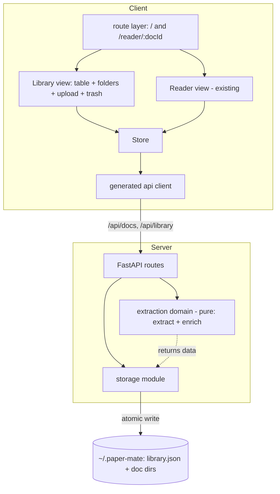
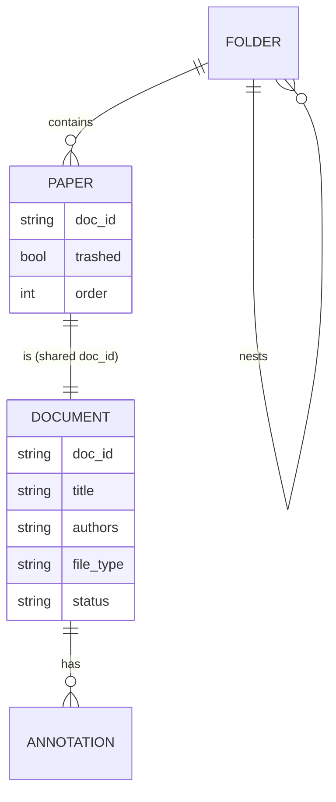

# Architecture Spine — Paper Mate Library

Epic-altitude spine. Inherits the initiative spine (`architecture-paper-mate-2026-06-28`) as **binding, read-only** constraints and decides only what the Library opens up (the parent's *Deferred* "Phase 2 → Library page"). New decisions are namespaced `AD-Ln` so they never collide with the parent's `AD-1..AD-12`.

## Design Paradigm

Inherits **client-authoritative layered SPA over a filesystem store**, with **one amendment the Library introduces**:

- **Client** gains a **route layer** (React Router) above the existing layers. Two route-level views — **Library** (home) and **Reader** (annotator) — sit at the same level; both depend downward on `store → api-client`. The strict downward-dependency rule (AD-9) is unchanged.
- **Backend** grows a **thin bounded domain layer above storage** — metadata **extraction** is its first tenant (AD-L2). This **amends** the parent's "backend is a dumb store with *no* domain logic" (AD-6): the load-bearing claims survive (filesystem is the source of truth, storage is the sole disk writer, annotations stay client-authoritative), but the backend may now run bounded domain logic that *produces* data storage persists. Introducing background extraction also **narrows** AD-6's "no concurrency": still single *user*, but intra-process background work now runs against user actions, so the collection-index write path must be concurrency-safe (AD-L7). The parent's own *Deferred* (agents, sync) already anticipated this layer. **Carry to upstream:** propose amending the parent spine's AD-6/paradigm wording so the two don't silently diverge.

## Inherited Invariants

Parent ADs that bind the Library, by their original ids — read-only, never re-derived. A local decision that contradicts one is a conflict to surface (see AD-L2 ↔ AD-6).

| Inherited | From parent | Binds here |
| --- | --- | --- |
| AD-1 | initiative spine | Localhost SPA ↔ dockerized FastAPI owns **all** disk I/O; client never touches the filesystem. All Library upload/persistence goes through the API. |
| AD-2 | initiative spine | Stack: FastAPI+Pydantic v2 / React+Vite SPA (no meta-framework) / `pdfjs-dist` raw. A client-side router is **not** a meta-framework (AD-L3), so no conflict. |
| AD-3 | initiative spine | Pydantic models → OpenAPI → **generated** TS client types. All new Library API types are generated, never hand-authored. |
| AD-6 | initiative spine | Filesystem is the durable source of truth; client store is a working copy hydrated on open, flushed on change; single user. **"No domain logic" clause amended by AD-L2; "no concurrency" narrowed by AD-L7** (still single user, but background extraction runs concurrently with user actions). |
| AD-8 | initiative spine | `~/.paper-mate/library/{doc_id}/` = `source.pdf`+`annotations.json`+`meta.json`; `doc_id` = SHA-256 of PDF bytes, computed once, idempotent import; `meta.json` storage-owned. Library **extends `meta.json` additively** (authors, file_type, extraction status). |
| AD-9 | initiative spine | The storage module is the **only** code touching `~/.paper-mate`; routes never touch the filesystem; the client reaches the backend **only** through the generated API client. |
| AD-10 | initiative spine | Single same-origin container; FastAPI serves API + built SPA; no CORS; no auth. |
| AD-5/AD-6/AD-7 (annotation model + doc-scoped store) | initiative spine + Story 5.8/3.5 | Reused **unchanged**: a Library paper's `doc_id` *is* its annotation-store key. FR-18/19 open-in-annotator hydrates existing annotations through the doc-scoped store; no new annotation model. |

## Invariants & Rules

Dependency direction the Library adds (a rule, not a picture):



### AD-L1 — Collection store & authority split
- **Binds:** FR-1, FR-2, FR-12, FR-13, FR-14, FR-15, FR-21, FR-22; NFR-4, NFR-5
- **Prevents:** two authoritative copies of a paper's fields; O(N) boot scans; orphaned/dangling collection state
- **Rule:** `~/.paper-mate/library.json` is the **authoritative index** for cross-doc state — folder tree (identity, nesting, names, incl. *empty* folders), folder membership (paper → ≤1 folder), trash state, and paper inclusion + folder/insertion order. (Paper *table* ordering, the row order, is the client sort, FR-5/AD-L3, not persisted. **Amended 2026-07-08 (Story 7.11):** table *column-layout preferences* (column order, visibility, widths) DO persist, but client-side only in a `localStorage` UI-prefs store, never in `library.json`/`meta.json`; this is app-global UI state, distinct from row ordering, and does not touch the storage-sole-writer invariant.) Per-doc `meta.json` stays authoritative for a paper's **own** fields (title, authors, added, page_count, file_type, extraction status); membership and trash are **not** stored on the paper. `library.json` MAY carry a **non-authoritative display cache** of title/authors, rebuildable from `meta.json` (meta wins on conflict; refreshed on write) so the table renders in one read (NFR-4). Both files are written **only** by the storage module (AD-9). **Boot reconcile:** a `{doc_id}/` dir absent from the index → added as Uncategorized; an index entry whose dir vanished → pruned. `library.json` carries `schema_version`; additive changes only (NFR-5).

### AD-L2 — Metadata extraction on the backend (opens the domain layer)
- **Binds:** FR-7, FR-8, FR-9, FR-10, FR-11; NFR-1, NFR-3
- **Prevents:** foreclosing the backend-only accuracy ceiling (GROBID); browser-CPU contention on bulk upload; a paper lost to a failed parse
- **Rule:** metadata extraction runs on the **backend** as a bounded, **pure** domain module — the **first tenant** of a `server/app/domain/` layer above storage. Two interfaces: `extract(pdf_bytes) → ExtractedMeta` (rung 1 embedded `/Info`+XMP, then rung 2 font-size heuristic; **PyMuPDF** in-process this sprint, **GROBID-swappable** at Phase 2) and `enrich(meta) → meta | "skipped"` (rung 3 external lookup, **DOI-first then title/authors fallback**; **Crossref** covers both paths, Semantic Scholar an optional later secondary for no-DOI preprints; offline/failure returns `"skipped"`, **never blocks the add**, surfaces a non-error notice per FR-9). Both are **best-effort**: a failed parse still enters the paper as filename-title (FR-10), never lost. Extraction is a **background task**, never on the request path (NFR-3). The client learns resolved metadata by **polling** `GET /api/library` (single user; no push channel). Storage stays the **only** writer (AD-9): extraction returns data, storage persists it to `meta.json` and refreshes the `library.json` display cache. **Conflict (surfaced, accepted):** this amends AD-6's "no domain logic" clause — see *Design Paradigm*.

### AD-L3 — Client routing / front-door flip
- **Binds:** FR-1, FR-14, FR-18, FR-20, FR-22
- **Prevents:** refresh/back losing the user's place; per-view ad-hoc navigation state; a router drifting toward a meta-framework
- **Rule:** the SPA adopts **React Router in library/data mode** (`createBrowserRouter`) — **not** framework mode (file-based routing + SSR is a meta-framework and is excluded by AD-2) — with **exactly two routes**: `/` (Library home, the boot landing, FR-1) and `/reader/:docId` (Reader for that paper). Double-clicking a row navigates to `/reader/:docId` (FR-18); the reader's back-to-Library is a navigation to `/` (FR-20). Folder selection, sort/filter, and **Trash are view-state filters inside the Library route, not routes** (lenses on one collection). Settings stays a modal (Story 5.1), not a route. The router owns navigation/history only; it does **not** own collection/domain state (store + backend do). AD-2 preserved — a client router *in library/data mode* is not a meta-framework.

### AD-L4 — Bulk-add flow & idempotent upload
- **Binds:** FR-7, FR-8, FR-10; NFR-3, NFR-6; AD-8
- **Prevents:** table freeze on bulk add; ambiguous partial-failure; duplicate rows for one paper; a paper lost to a failed parse
- **Rule:**
  1. Upload = one **`POST /api/docs` per PDF**, client-throttled (concurrency cap ~4). Each returns an **optimistic row immediately** (`doc_id`, title=filename, `status: extracting`); rows stream into the table as requests land (NFR-3).
  2. Every paper carries an **extraction status** `extracting → ready | enrich-skipped | parse-failed`. The client **polls `GET /api/library`** until all statuses settle, then stops.
  3. **Failure splits:** a *store* failure (not a PDF / disk error) rejects that one file with a per-file notice, others unaffected; a *parse* failure still enters the paper as filename-title, `status: parse-failed`, editable (FR-10) — never lost.
  4. **Idempotent dedupe by `doc_id`** (AD-8): a re-upload resolving to an existing `{doc_id}/` creates **no duplicate row** and returns the existing paper; if that paper is **trashed, the re-upload restores it** ("restored from Trash"). Existing `annotations.json`/`meta.json` are never overwritten.
  5. **Safe copy-in** (NFR-6): storage writes `source.pdf` atomically (temp + rename) so a mid-copy failure leaves the collection consistent and never corrupts the original.

### AD-L5 — Trash & folder lifecycle
- **Binds:** FR-12, FR-13, FR-16, FR-22, FR-23, FR-24 (ratifies PRD assumption A1)
- **Prevents:** annotation loss on delete; ambiguous restore target; orphaned folder subtrees; papers deleted along with their folder
- **Rule:**
  1. **Soft-delete** (FR-22): flip `trashed` in `library.json`; annotations untouched; the paper leaves normal/folder views and shows only in the Trash filter; it **retains** its folder membership while trashed.
  2. **Restore** (FR-23): clear `trashed`; the paper returns to its remembered folder; if that folder no longer exists, it lands in Uncategorized.
  3. **Purge** (FR-24): permanent — delete the whole `{doc_id}/` dir + its `library.json` entry; annotations go with it. Manual only, no auto-purge.
  4. **Delete folder** (FR-16, ratifies **A1**): deletes that folder **and all descendant folders** (whole subtree); every paper anywhere in the subtree → Uncategorized. A folder delete **never** deletes papers.
  5. Each paper belongs to **≤1 folder** (FR-13); membership is authoritative in `library.json` (AD-L1).

### AD-L6 — API boundary: document vs organization
- **Binds:** FR-1, FR-3, FR-7, FR-11, FR-15, FR-18, FR-22, FR-23, FR-24; AD-3, AD-8, AD-9, AD-L1
- **Prevents:** one entity served authoritatively by two surfaces; content/collection concerns blurring; churn on shipped reader endpoints
- **Rule:** one entity (`doc_id`, AD-8), two concern-scoped surfaces, each mapped to the file it is authoritative for (AD-L1):
  - **`/api/docs/{doc_id}` — the individual document** (`{doc_id}/` dir): `GET /api/docs` (list), `POST /api/docs` (upload/create — **keeps the shipped import route**), `GET /api/docs/{id}` (own metadata), `PATCH /api/docs/{id}` (edit title/authors, FR-11 — authoritative on `meta.json`, storage refreshes the cache), `DELETE /api/docs/{id}` (**purge**, FR-24 — destroys the dir; storage prunes the `library.json` entry), `GET /api/docs/{id}/file`, `GET`/`PUT /api/docs/{id}/annotations` (reader content, unchanged).
  - **`/api/library` — the organization layer** (`library.json`): `GET /api/library` (the **table** via the AD-L1 display cache — one fast read, FR-1 + poll target), `/api/library/folders` CRUD (subtree delete, AD-L5), and **set-based** `POST /api/library/move | trash | restore` taking `{doc_ids}` (FR-15/22/23, multi-select FR-3).
  - **Trash is organizational** (doc still on disk, flagged) → `/api/library`; **purge destroys the document** → `DELETE /api/docs/{id}`. All under AD-3 (generated types) + the inherited `{detail}` error envelope.

### AD-L7 — Collection-index write concurrency
- **Binds:** AD-L1, AD-L2, AD-L4, AD-L6; NFR-3 (narrows inherited AD-6 "no concurrency")
- **Prevents:** lost updates / a clobbered `library.json` when a background extraction cache-refresh interleaves with a concurrent user org op (move/trash/restore) or a duplicate-in-one-batch create — a race the inherited AD-6 "no concurrency" assumed away but AD-L2's background tasks reintroduce
- **Rule:** the storage module **serializes all `library.json` mutations**: every write is a **read-modify-write of the whole index under a process-level lock** (async lock / file lock), so a background extraction refresh (AD-L2) and a user `move`/`trash`/`restore` (AD-L6) never interleave — whole-file last-writer-wins can no longer drop a change. Per-`doc_id` creation is likewise serialized and idempotent, so the same PDF dropped twice in one batch (identical bytes → identical `doc_id`) resolves to **one** `{doc_id}/` (AD-8, AD-L4). Whole-file atomic write (temp + rename) stands. This is the collection-index analogue of the inherited AD-7 single-flight annotation autosave. Scope: single *user*, but the app now has intra-process background concurrency, so the index write path is concurrency-safe by construction, not by assumption.

## Consistency Conventions

Additions to the inherited convention table; inherited rows (coordinates, annotation model, doc_id = SHA-256, dates, disk-writes-via-storage, client-via-generated-client) still hold.

| Concern | Convention |
| --- | --- |
| Collection index | `~/.paper-mate/library.json`, storage-owned, `schema_version`, additive-only (AD-L1). Authoritative for folder tree, membership, trash, order; carries a non-authoritative title/authors display cache. |
| Per-paper metadata | `meta.json` extended additively: `{filename, title, authors, page_count, added, last_opened, file_type, status, schema_version}` (AD-8 + AD-L1). Folder/trashed live in `library.json`, **not** here. |
| Extraction status | `extracting → ready | enrich-skipped | parse-failed` (AD-L4). |
| Folder membership | Paper → ≤1 folder; empty folders allowed; nesting; delete = subtree (AD-L5). |
| Folder identity | Folder id = UUIDv4 (inherited IDs convention); **name is mutable**, keyed by id, so rename (FR-12) never orphans membership. |
| Index writes | All `library.json` mutations serialized read-modify-write under a lock, atomic temp+rename (AD-L7). |
| Routes | Exactly `/` (Library) and `/reader/:docId` (Reader); Trash/folders/sort/filter are Library view-state, not routes (AD-L3). |
| API surface | `/api/docs/{doc_id}` = document (content + own metadata); `/api/library` = organization (table, folders, move/trash/restore). Set-based org ops take `{doc_ids}` (AD-L6). |
| Errors | Inherited single `{ "detail": string }` envelope; enrichment-skipped is a **non-error** client notice, not an error (FR-9). |
| No em-dash in UI strings | Table labels, folder names UI, toasts/notices ("restored from Trash", "enrichment skipped") must avoid `—` (DESIGN.md). |

## Stack

Additions to the inherited stack; verify + pin exact patches at scaffold.

| Name | Version |
| --- | --- |
| React Router — **library/data mode** (`createBrowserRouter`) | v7.x — add at Library scaffold, pin exact patch; React 19-compatible. **Not** framework mode (that is a meta-framework, excluded by AD-2). |
| Backend PDF parse (rungs 1–2) | **PyMuPDF (fitz)** — chosen; AGPL-3.0, so the repo relicenses MIT→AGPL (see Deferred) |
| GROBID (rung 4, Phase-2 upgrade) | Apache-2.0 service — `extract()` GROBID-swappable; **HTTP sidecar** (adds a container, amends AD-10); not built this sprint |
| Backend HTTP client (enrich) | current `httpx` (or equivalent) — Crossref DOI-first then title/author query |

## Structural Seed

Storage layout (code owns the detail):

```text
~/.paper-mate/
  library.json            # AD-L1: authoritative collection index (folder tree, membership,
                          #        trash, order) + non-authoritative title/authors display cache
  library/{doc_id}/       # AD-8: one dir per document, doc_id = SHA-256 of PDF bytes
    source.pdf
    annotations.json      # reader marks (inherited, unchanged)
    meta.json             # AD-8 + AD-L1: the paper's OWN fields (title, authors, added,
                          #               page_count, file_type, status, schema_version)
  config.json             # reserved (Phase 3, inherited)
```

Source-tree additions (only what's new; existing layers unchanged):

```text
client/src/
  routes/        # NEW: createBrowserRouter, / and /reader/:docId (AD-L3)
  library/       # NEW: table, folders panel, upload orchestration, trash (collection UI)
  reader/        # existing annotator view
  store/  api/   # inherited layers (working copy + generated client)
server/app/
  routes/        # docs.py extended (list/get/patch/delete) + library.py (organization)
  domain/        # NEW: extraction — pure extract() + enrich() (AD-L2, first domain tenant)
  storage/       # extended: library.json read/write + boot-reconcile + display cache;
                 #           still the ONLY disk writer (AD-9)
  models.py      # + Pydantic: CollectionRow, Folder, ExtractedMeta, status enum (AD-3)
  agents/        # reserved Phase-3 (inherited)
```

Core entities (names + relationships; attributes that are invariants live in the ADs):



## Capability → Architecture Map

| Capability (PRD) | Lives in | Governed by |
| --- | --- | --- |
| FR-1,2 collection + table + count | client `library/` ← `GET /api/library` | AD-L1, AD-L6 |
| FR-3 multi-select batch actions | client `library/` + set-based `/api/library` ops | AD-L6 |
| FR-4,5,6 display / sort / filter | client `library/` (view state) | AD-L3 |
| FR-7 bulk upload | client `library/` upload + `POST /api/docs` | AD-L4 |
| FR-8,9,10,11 extract / enrich / best-effort / inline edit | server `domain/` extraction + `PATCH /api/docs/{id}` | AD-L2, AD-L4, AD-L6 |
| FR-12..16 folders (create/rename/delete/nest/assign) | client `library/` + `/api/library/folders` | AD-L1, AD-L5, AD-L6 |
| FR-17 Note file-type (reserved, displayed) | `models.py` + `meta.json` `file_type` | AD-L1 |
| FR-18,19,20 open in annotator + return | client `routes/` + inherited doc-scoped store | AD-L3, inherited AD-6/AD-8 |
| FR-21 persistence | server `storage/` (library.json + doc dirs) | AD-L1, inherited AD-8 |
| FR-22,23,24 trash / restore / purge | client `library/` + `/api/library` + `DELETE /api/docs/{id}` | AD-L5, AD-L6 |
| NFR-1 local-first | enrich degrades to "skipped" offline | AD-L2 |
| NFR-3 non-blocking add | server background task + client poll | AD-L2, AD-L4 |
| NFR-4 collection scale | `GET /api/library` display cache (one read) | AD-L1, AD-L6 |
| NFR-6 safe copy-in | server `storage/` atomic write | AD-L4, inherited AD-8 |

## Deferred

- **Sync (F8, FR-25..29)** — a separate follow-on epic. A switchable-backend interface (WebDAV first, Google Drive later) mirroring the reserved agent abstraction; whole-directory mirror of `~/.paper-mate`; last-write-wins by mtime. Hard problems resolved in that epic's own discovery: trigger cadence, Google Drive OAuth on a localhost/Docker app, deletion/Trash propagation, interrupted-push consistency, credential encryption at rest. **Not designed here** — the seam is only reserved.
- **GROBID-class extraction (rung 4)** — `extract()` is GROBID-swappable; the accuracy upgrade is a Phase-2 reading-helper concern (references/abstract/affiliations). Adopting it adds a GROBID **sidecar container** → amends AD-10 "single container" (called over HTTP, so Apache-2.0 stays license-clean). Not built this sprint.
- **Repo relicense MIT → AGPL-3.0** — required to bundle PyMuPDF (AGPL copyleft is viral on distribution). Action at the extraction story / before distributing a bundled build; personal local-only use never triggers it.
- **Semantic Scholar secondary enrich** — optional later, for no-DOI preprints (arXiv) the Crossref path misses. The `enrich()` seam already accommodates it.
- **Note identity** — FR-17 reserves a Note file-type (displayed), but `doc_id` = SHA-256 of *PDF bytes* (AD-8) does not define identity for a non-PDF note. Note *authoring* is out of scope this sprint (nothing creates a note), so identity is defined when note authoring lands.
- **Bulk API endpoints** beyond set-based `move/trash/restore` — added only if per-item calls stall (single-user, small N).
- **PRD out-of-scope** — global search nav, Chats tab, full-text indexing, viewed/last-opened tracking, in-app note authoring.
- **Upstream reconciliation** — propose amending the parent spine's AD-6/paradigm wording to reflect the backend domain layer AD-L2 opens (so upstream and this spine don't diverge).
