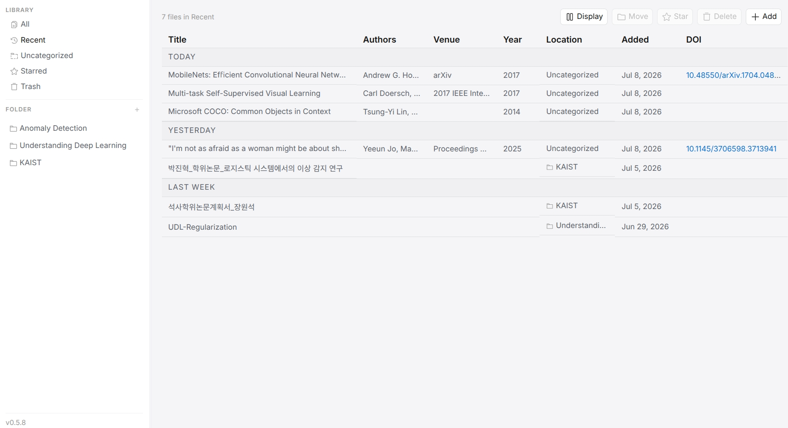
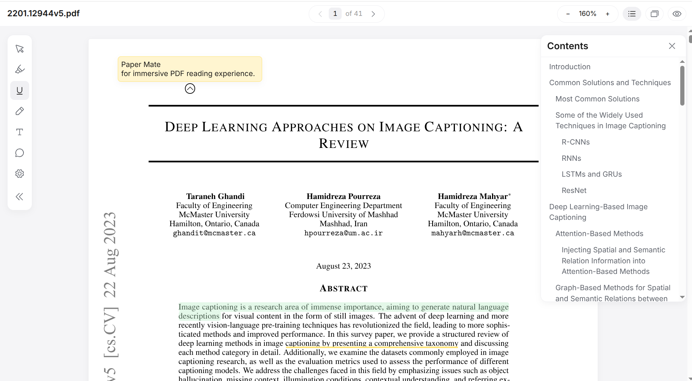

<h1 align="center">
  
  Paper Mate
</h1>

<p align="center">
  <strong>A local PDF reader for research and study.</strong><br/>
  <em>Read, mark up, and reopen papers with your notes still where you left them.</em>
</p>

<p align="center">
  <a href="LICENSE"></a>
  <a href="https://github.com/Cotidie/paper-mate"></a>
  <a href="https://github.com/Cotidie/paper-mate/stargazers"></a>
  <a href="https://github.com/Cotidie/paper-mate/issues"></a>
</p>

<p align="center">
  
  
  
  
  
  
  
</p>

## Overview

Paper Mate is a local web app for keeping research PDFs, metadata, folders, and annotations in one place. The browser handles the library, reader, and annotation UI. A small FastAPI server saves files and annotations to disk.

The current version focuses on library management and PDF reading: table view, folders, recent and starred papers, page navigation, annotation tools, and an annotation bank. Local AI-assisted reading is planned later. For now, Paper Mate keeps private PDFs local and makes it easy to return to a paper with your notes still in place.

<table>
  <tr>
    <th width="50%">Library</th>
    <th width="50%">Reader</th>
  </tr>
  <tr>
    <td width="50%"></td>
    <td width="50%"></td>
  </tr>
</table>

## Features

### 🗂️ Library

- Table view with title, authors, venue, year, folder, date added, and DOI
- Folder-based organization with uncategorized and trash views
- Recent and starred documents
- Resizable metadata columns
- Local library stored under `~/.paper-mate`

### 📄 Paper reading

- Local PDF opening
- Page controls and table of contents
- Smooth scroll, zoom, and pan
- Stable pages while annotations are shown or hidden

### ✍️ Annotation

- Highlight, underline, pen, memo, comment, and box tools
- Quick box for choosing tools after text selection
- Recolor, move, resize, delete, undo, and redo
- Hide or show all annotations

### 💾 Review and storage

- Annotation Bank with click-to-jump
- Local autosave and restore for PDFs and annotations
- Original PDF left untouched

### 🔭 Planned

- Footnote and reference previews
- Author and venue grouping
- Export with annotations
- Local AI chat through CLI agents
- Click or drag a paper region into chat context

## Quick Start

### Run with Docker

```sh
git clone https://github.com/Cotidie/paper-mate.git
cd paper-mate
docker compose up --build
```

Open `http://localhost:8000` after the container starts. Your library is stored in `./.paper-mate` (see `.env.example` to point it elsewhere).

### Develop locally

Run the backend and frontend in separate shells:

```sh
cd server && uv run uvicorn app.main:app --reload --port 8000
```

```sh
cd client && npm install && npm run dev
```

Open the Vite URL shown in the terminal, usually `http://localhost:5173`.

## Perfect For

- Researchers who read papers every day.
- Graduate students marking lecture notes, papers, and drafts.
- Anyone who wants PDF annotation without uploading papers to a cloud service.
- Readers who prefer local files, local annotations, and a quiet interface.

## License

Paper Mate is released under the GNU Affero General Public License v3.0 (AGPL-3.0). See [LICENSE](LICENSE). It bundles PyMuPDF for metadata extraction, which is AGPL-3.0; the combined distributed work is therefore AGPL-3.0. Running Paper Mate locally for personal use never triggers the license's distribution obligations.

## Acknowledgement

Paper Mate uses PDF.js for PDF rendering, React and Vite for the client app, FastAPI for the local backend, Zustand for client state, and perfect-freehand for pen strokes.

The product shape comes from the BMad planning artifacts in this repository, especially the v1 viewer and annotator spec.
